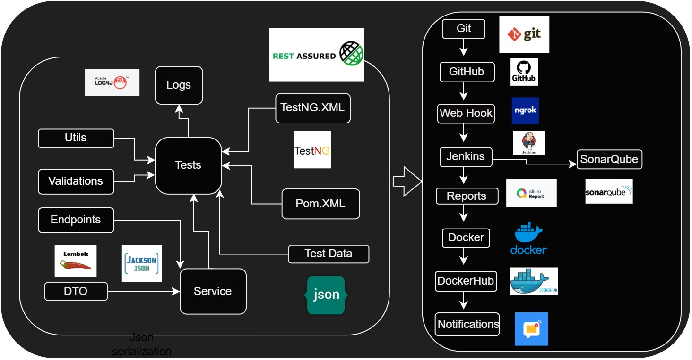

<h1 align="center"> API Automation Framework</h1>  

## Contents

- [Introduction](#introduction)
- [Features](#features)
- [Requirements](#requirements)
- [Quick Start](#quick-start)

## Introduction

This is a sample API automation project for testing some real time sample apis from https://jsonplaceholder.typicode.com to perform all the verbs (GET, POST, PUT,PATCH, DELETE) apis validation

the apis used in this example is 
- GET: [https://jsonplaceholder.typicode.com](https://jsonplaceholder.typicode.com)
- POST:  [https://jsonplaceholder.typicode.com](https://jsonplaceholder.typicode.com)
- PUT:  [https://jsonplaceholder.typicode.com](https://jsonplaceholder.typicode.com)
- PATCH:  [https://jsonplaceholder.typicode.com](https://jsonplaceholder.typicode.com)
- DELETE: [https://jsonplaceholder.typicode.com](https://jsonplaceholder.typicode.com)
  
## Framework Architecture 

## Features

- Data driven testing
- Custom validations 
- Parallel execution
- Test Reports
- CI/CD integration

## Requirements

* [Java 11 SDK](https://www.oracle.com/au/java/technologies/javase/jdk11-archive-downloads.html)
* [Maven](https://maven.apache.org/download.cgi)

## Reporting

