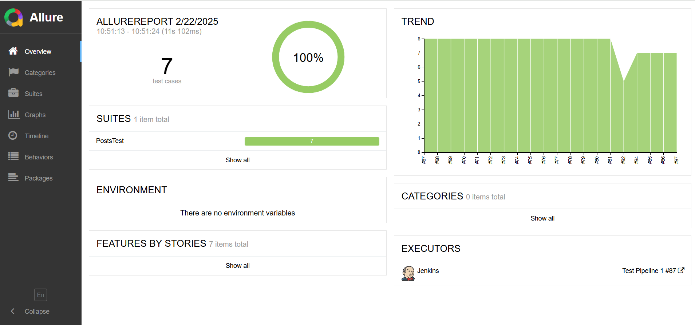

<h1 align="center"> API Automation Framework</h1>  

## Overview

This API automation project is designed to test real-time APIs from https://jsonplaceholder.typicode.com by performing the HTTP methods (GET, POST, PUT, PATCH, DELETE). The framework utilizes Lombok to reduce boilerplate code and Jackson annotations for efficient serialization. TestNG annotations are used to manage test execution, and Log4j2 is implemented for logging, with both general and specific log files maintained. To optimize storage, only the last 7 days of log files are kept. The project integrates a CI/CD pipeline using Jenkins, with Docker for containerization and SonarQube for code analysis. A webhook is configured to trigger the pipeline, and email notifications are sent for build success or failure.
  
## Framework Architecture 

## Features

* Custom Validations - Allows for custom validation logic tailored to specific test scenarios
* Parallel Execution - Enables parallel test execution to reduce test runtime and increase efficiency
* Test Reports - Allure reports for detailed test insights, providing comprehensive logs and visual results
* CI/CD Integration - Integrated with Jenkins and Docker to automate the build, testing, and deployment pipeline, ensuring continuous delivery and rapid feedback for every code change
* Reusable Components - The shared code in the base and utils modules enhances reusability and minimizes redundancy, promoting cleaner and more maintainable code
* Environment-Specific Data Management - Supports dynamic loading of environment-specific test data, allowing seamless switching between different configurations for various test environments
* Data Handling - Supports Data-Driven Testing using JSON files

## Prerequisites

* Java
* Maven
* TestNG
* Jenkins
* Docker
* SonarCube

## Allure Report

## CI/CD Pipeline

## 📜 License
This project is licensed under the MIT License - see the [LICENSE](LICENSE) file for details.

### © Copyright 2025 Lahiru Kasun
Unauthorized reproduction or claiming ownership of this project is prohibited.

## ⚠ Disclaimer
This project is provided **as is**, without any warranty or guarantee of any kind.  
The author is **not responsible** for any misuse, damage, or unintended consequences  
arising from the use of this software. By using this project, you agree to the **MIT License** terms  
and acknowledge that the author holds **no liability** for any issues that may arise.  

